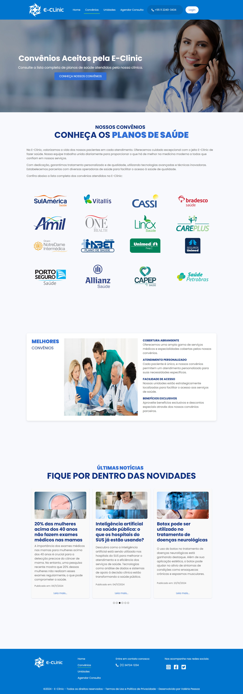
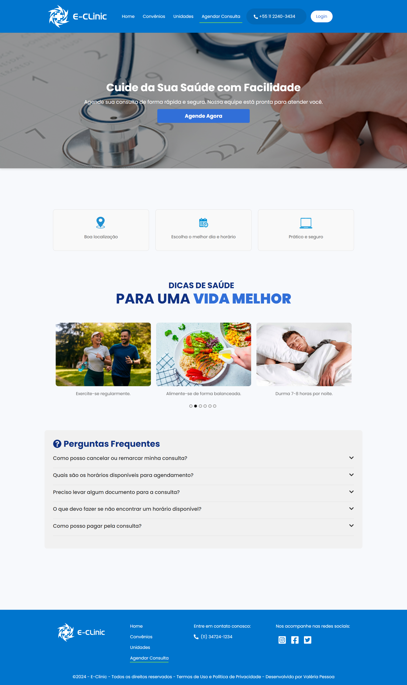
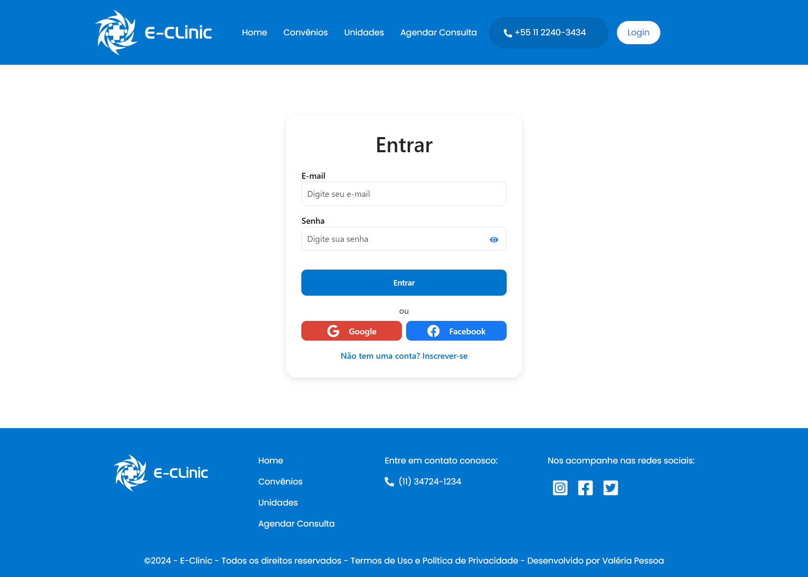
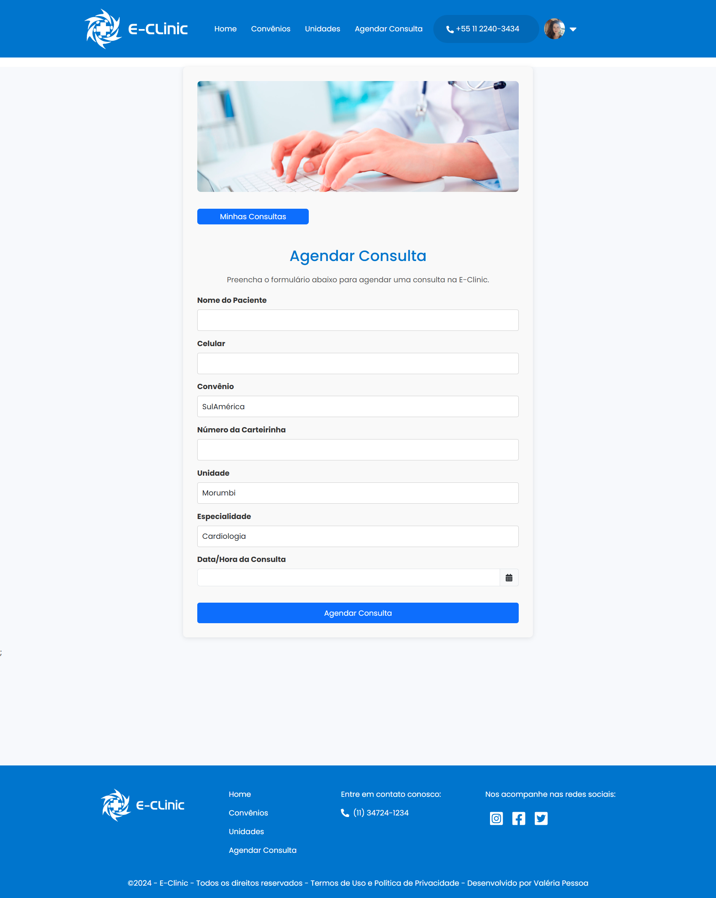
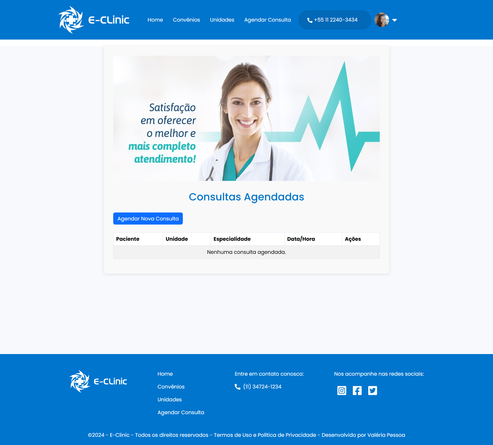

<div align="center">
  <h1>E-Clinic 🏥</h1>
</div>

<br>

## 📝 Descrição
E-Clinic é uma aplicação web desenvolvida para gerenciar consultas médicas e serviços de saúde. A aplicação permite que os usuários agendem consultas, visualizem suas consultas agendadas, alterem a data da consulta ou a cancelem. Além disso, os usuários podem acessar informações sobre convenios e unidades de saúde. O site utiliza um banco de dados MongoDB para armazenar dados de consultas e usuários, garantindo eficiência e escalabilidade. A autenticação é suportada através de integrações com Google e Facebook, proporcionando uma experiência de login simplificada e segura.

<br>

## 🌐 Link do Site
[E-Clinic](https://e-clinic-projeto.vercel.app)

<br>

## 🛠️ Tecnologias Usadas
- **Next.js**: Framework React para renderização do lado do servidor.
- **TypeScript**: Linguagem de programação que adiciona tipagem estática ao JavaScript.
- **MongoDB**: Banco de dados NoSQL para armazenamento de dados.
- **React**: Biblioteca JavaScript para construção de interfaces de usuário.
- **Bootstrap**: Framework CSS para desenvolvimento responsivo e design de interfaces.
- **NextAuth.js**: Biblioteca para autenticação em aplicações Next.js.
- **Axios**: Cliente HTTP para fazer requisições.
- **Mongoose**: ODM (Object Data Modeling) para MongoDB e Node.js.
- **React Datepicker**: Componente de seleção de data para React.
- **Zod**: Biblioteca para validação de esquemas.
- **Date-fns**: Biblioteca para manipulação de datas.
- **bcryptjs**: Biblioteca para criptografia de senhas.

<br>

## 🚀 Como Executar
1. Clone o repositório:
   ```bash
   git clone https://github.com/seu-usuario/e-clinic.git
   ```
2. Instale as dependências:
   ```bash
   cd e-clinic
   npm install
   ```
3. Configure as variáveis de ambiente no arquivo `.env`.
4. Inicie o servidor de desenvolvimento:
   ```bash
   npm run dev
   ```

<br>

## 🤝 Contribuição
Contribuições são bem-vindas! Sinta-se à vontade para abrir uma issue ou enviar um pull request.

<br>

## 📜 Licença
Este projeto está licenciado sob a Licença MIT.

<br>

## 📸 Screenshots
### Tela Inicial


### Convênios


### Unidades


### Agendar Consulta


### Login


### Formulário de Agendamento de Consulta


### Consultas Agendadas



